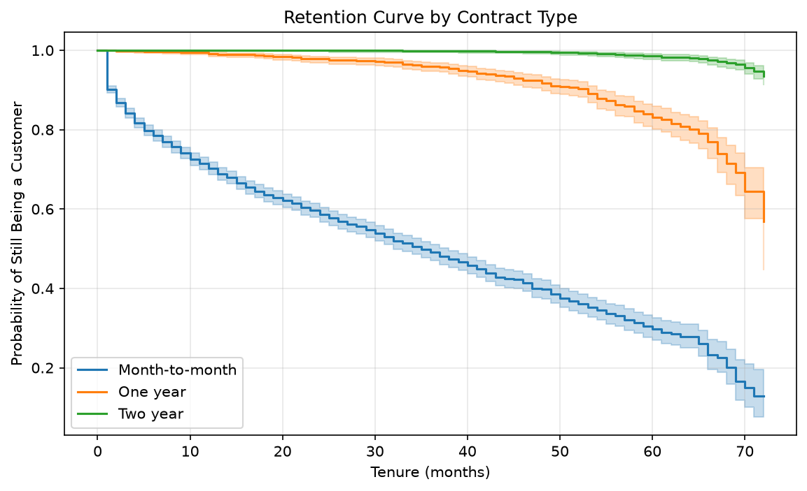
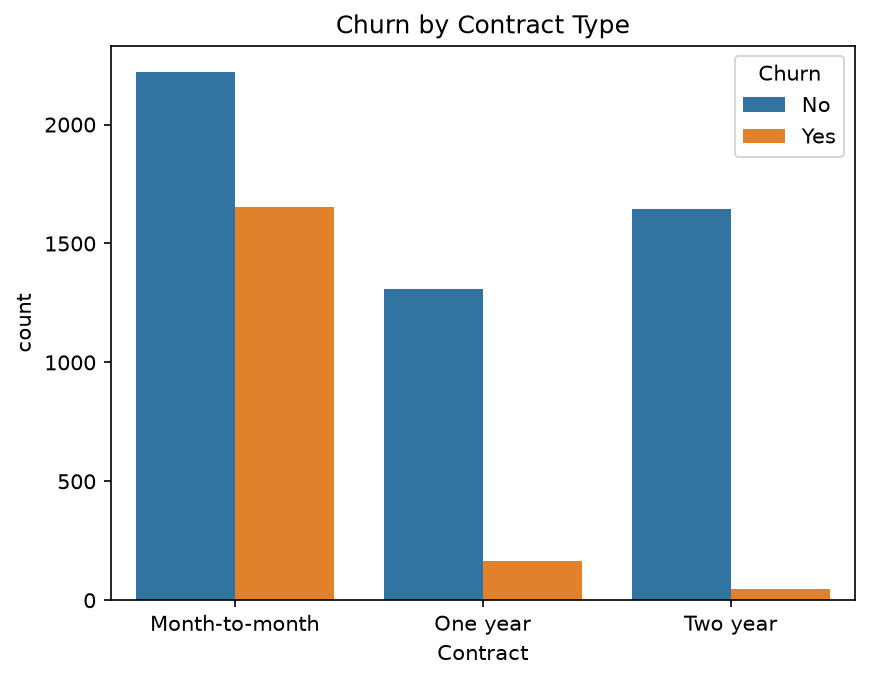
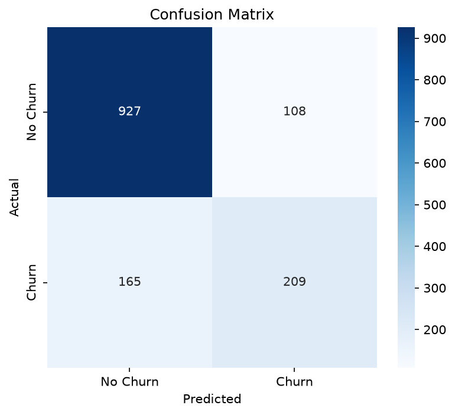
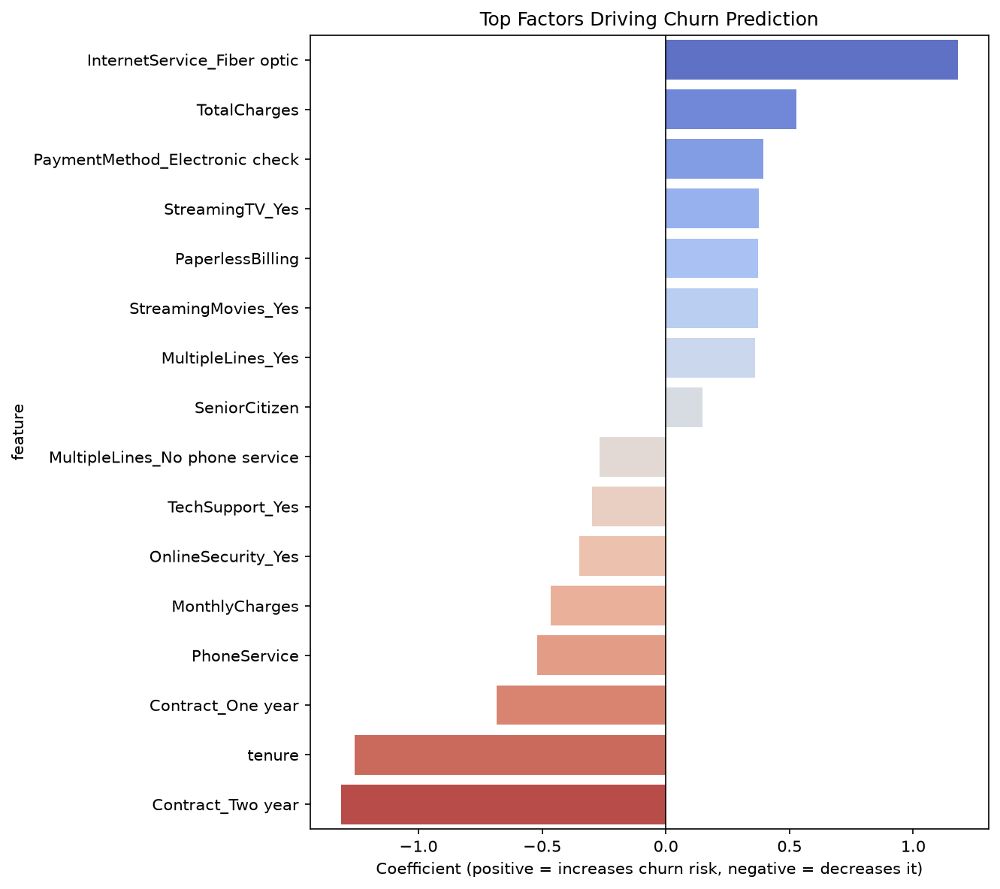

# Customer Churn & Revenue Leakage Analytics

## Business Question
Which customer segments are most likely to churn, and how much monthly recurring revenue is at risk as a result? This project identifies at-risk customers, quantifies the revenue exposure tied to predicted churn, and surfaces the service/contract factors driving it — turning a churn prediction into a dollar-denominated business problem.

## Dataset
[IBM Telco Customer Churn](https://www.kaggle.com/datasets/blastchar/telco-customer-churn) — 7,043 customers of a telecom provider, with tenure, contract type, services subscribed, monthly/total charges, and churn status.

## Approach
1. **Data Cleaning & EDA** — handled missing values, type corrections, explored churn drivers across contract, tenure, payment, and service features
2. **Cohort & Retention Analysis** — tenure-based cohorts and Kaplan-Meier survival curves, segmented by contract type
3. **Predictive Modeling** — logistic regression to classify individual churn risk, with threshold tuning for business impact
4. **Revenue Leakage Estimation** — translated predicted churn into monthly recurring revenue at risk

## Key Findings

**Overall churn:** 26.5% of customers churned, representing **$139,130/month** ($1.67M/year) in lost recurring revenue across the full dataset.

**Contract type is the strongest churn driver.** Month-to-month customers churn at **42.7%**, versus **11.3%** for one-year and just **2.8%** for two-year contracts — a 15x gap between highest and lowest risk. Confirmed independently by both EDA and the model's feature importance.

**Churn is heavily front-loaded.** 52.9% of customers churn within their first 6 months, dropping to 6.6% for customers with 5+ years tenure. Retention curves by contract type show two-year customers stay above 90% retained even after 6 years, while month-to-month retention falls to ~15% over the same period.

**Other risk factors:** fiber optic internet (41.9% churn vs. 19% DSL), electronic check payment (45.3% vs. ~15-17% for automatic payments), and lack of tech support/online security add-ons (~3x higher churn) all independently increase risk. Customers with a partner or dependents churn roughly half as often as those without, pointing to household stability as a factor.

**Model performance:** A logistic regression model achieved 80.6% accuracy and 0.842 ROC-AUC. At a tuned classification threshold (0.35, chosen to prioritize recall over precision — missing a churner is costlier than a false alarm), the model caught 70.3% of actual churners.

**Revenue impact:** In the test set, churned customers represented **$27,215/month** in exposure. The model successfully flagged **74.3%** of that revenue ($20,224/month) for potential retention intervention, while $6,991/month went undetected.

## Recommendation
Retention efforts should prioritize month-to-month customers within their first 6 months — the highest-risk segment by a wide margin — with incentives to convert to longer contracts. The trained model can be used to proactively flag at-risk customers for targeted retention offers before they churn.

## Tech Stack
Python (pandas, numpy, scikit-learn, lifelines), matplotlib/seaborn for visualization, Jupyter notebooks.

## Repo Structure

├── data/
│ ├── raw/ # Raw Kaggle dataset
│ └── processed/ # Cleaned data + model predictions
├── notebooks/
│ ├── 01_eda.ipynb
│ ├── 02_cohort_retention_analysis.ipynb
│ ├── 03_churn_model.ipynb
│ └── 04_revenue_leakage_estimate.ipynb
├── reports/figures/ # Exported charts
└── data/data_dictionary.md # Column definitions

## Charts

